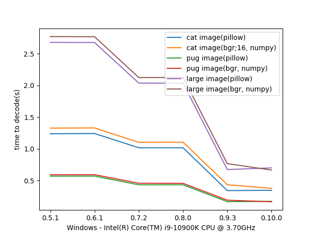
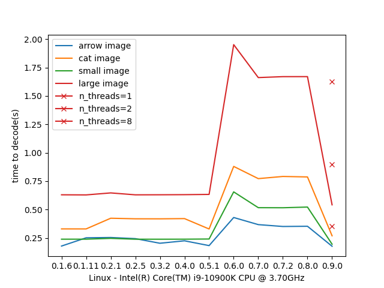
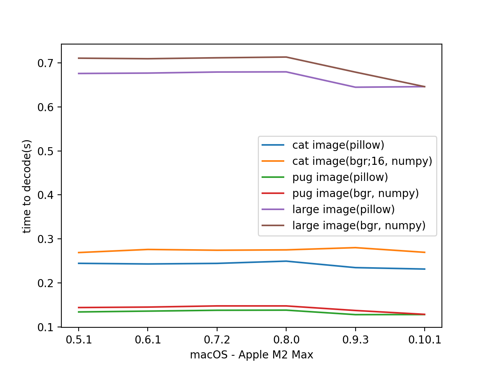

Benchmarks
==========

Decode benchmarks
-----------------

Images info:

pug.heic - 4032x3024 = 12MP, photo taken on iPhone with all metadata.

cat.hif - 2832x4240 = 12MP, 10 bit image, with Exif and IPTC data.

image_large.heic - 6000x8000 = 48MP, with Exif and IPTC data.

.. note:: in some cases decode speed is a bit slower compared to previous version, it will be fixed with new release of
    `Pillow <https://github.com/python-pillow/Pillow/issues/6933>`_

Encode benchmarks
-----------------

All images with size 4096x4096 = 16MP, without exif, xmp or other data, except `pug.heic`.

.. image:: ../benchmarks/results_encode_Windows.png

.. image:: ../benchmarks/results_encode_Linux.png

.. image:: ../benchmarks/results_encode_macOS.png
